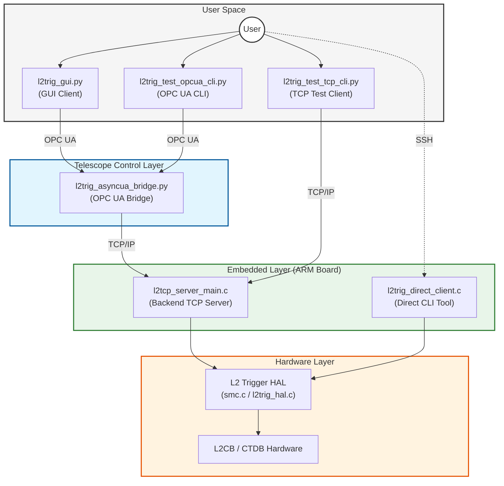

# System Architecture Diagram

This directory contains the system architecture diagram for the L2 Trigger System.

## Diagram (Mermaid Source)

You can copy the code below into your `README.md` to display the diagram (supported by GitHub, GitLab, and many Markdown editors).

## Layer Descriptions

- **User Space**: High-level clients for monitoring and control.
- **Telescope Control Layer**: The bridge between the standard OPC UA protocol and the custom backend TCP protocol.
- **Embedded Layer**: Software running directly on the ARM-based controller board.
- **Hardware Layer**: The physical L2CB and CTDB hardware and the low-level HAL (Static Memory Controller interface).
